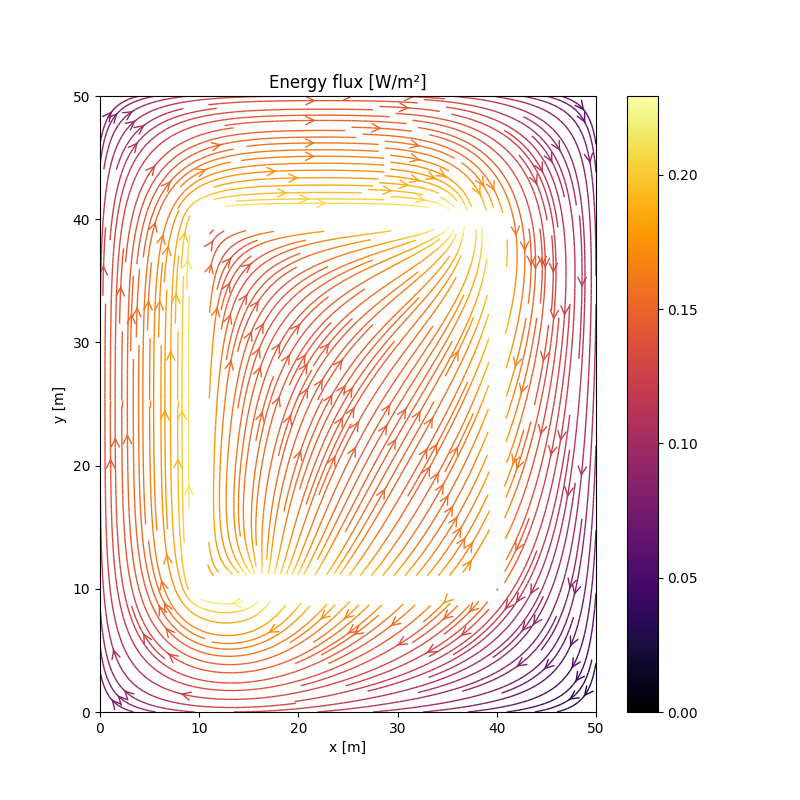
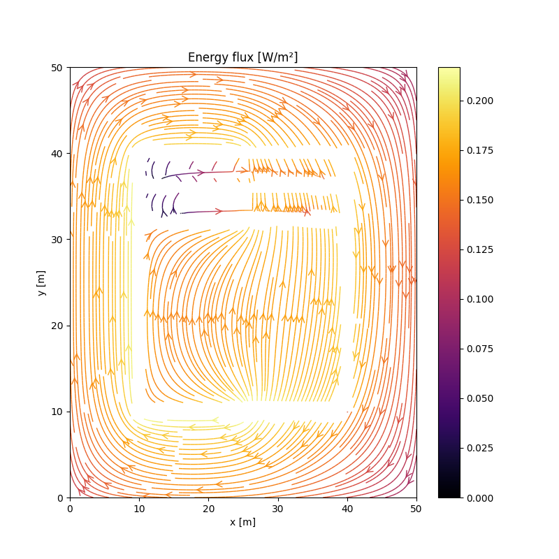

# PHY-1007 - Computational Homework
A small tool to visualize energy flux, electric field and magnetic field in arbitrary electrical circuits.

## Circuit obligatoires

On retrouve dans les quatres fichier python des circuits [a](examples/circuit_a.py), [b](examples/circuit_b.py) et [c](examples/circuit_c.py) dans le dossier [examples](examples).



Remarquons que dans les trois circuits, le flux de l'énergie va toujours de la source de tension à la résistance. En effet ceci s'explique par le fait que l'énergie se trouve dans les champs. On voit que même lorsque la position de la source par rapport à la résistance, le comportement du flux énergétique est le même. On retrouve toutes les autres figures des différentes simulations effectuées par le code dans le dossier [Images](Images).

## Circuit original

Commençons par regarder le circuit que nous avons fait dans un [simulateur](https://www.falstad.com/circuit/circuitjs.html?ctz=CQAgjCAMB0l3BWcMBMcUHYMGZIA4UA2ATmIxAUgpABZsKBTAWjDACgB3cFPEQmqmB58aUTt179aeKlMhsATtNmiaM8ISqC4i5RqoJhKAVGTyuawZpApj+sUtuiw1pzYwpTYHVzeZP2IS8-g4ggcEeYUFhhl46SuHunnSeIdryAOa02KmRNGpJppkURiaGwQiEReKJ2LFudZ7mNnaNLaIIGFXyjnadVW78WmZsAG7tIoLCQ0W06bMwCGxZifm8q3KhtbGrBenLEzODkVpsQA):


Ce circuit correspond à un diviseur de tension où trois charges de 100 Ω sont placées à différents points du circuit. Chacune d'entre elles dissipe une partie de l'énergie, mais aussi une partie du courant puisqu’elles sont toutes connectées à la mise à la terre. Regardons de plus près le flux énergétique de ce [circuit](examples/circuit_d.py):


Nous pouvons bien voir que le flux énergétique se déplace en diagonale directement dans la direction des différentes résistances malgré le fait que les fils du circuit suivent un parcours indirect. On peut toutefois voir certaines discontinuités dans le champ du flux énergétiques qui pourraient être expliquées par la présence de mises à la terre ainsi que de plusieurs charges alignées par rapport à la source de courant. Pour vérifier cette hypothèse, nous avons placé dans le circuit [(a)](examples/circuit_a.py) deux autres résistances en série pour former le circuit [concept](examples/circuit_concept.py) ([simulation](https://www.falstad.com/circuit/circuitjs.html?ctz=CQAgjCAMB0l3BWcMBMcUHYMGZIA4UA2ATmIxAUgpABZsKBTAWjDACgB3EFPPEbQnzDEU-QVE7gRYodMyjIk4aLR8ea-BK7YB3TXRWbFXA9wyjTAvsdrZRV-roeKAbo8IzuvT1So0qxFBBMAhsAE5eGnw6HqpBmOGR3P7uyb5mkjFptiopNsrZ6tmKEUXyqeVUCdq65aaVSnLmSQ1cBeXteY25VO1GkvXN9V0mdtn1-UA)) et nous obtenons le flux énergétique suivant:



En comparant avec le flux énergétique du circuit [(a)](Images/flux_a) à celui ci-dessus, on remarque que le graphique est beaucoup moins beau; la représentation de ce dernier comporte plusieurs discontinuités telles qu'observées dans notre circuit diviseur de tension.

## Pourquoi pas s'amuser en python

Sans être pertinent d'un point de vue physique, pourquoi ne pas s'amuser un peu avec ce joli code? On pourrait faire plein de boucles de potentiel pour former des mots automatiquement. Dans le code du fichier [circuit_easter](examples/circuit_easter.py) simplement changer la string suivante pour celle de son choix:

```
circuit, x, y = text2wire('Salut louis')
```
La fonction [Text2wires](examples/Text2wires.py) crée les fils et le monde à un certain gradient de potentiel ce qui donne le résultat suivant:


